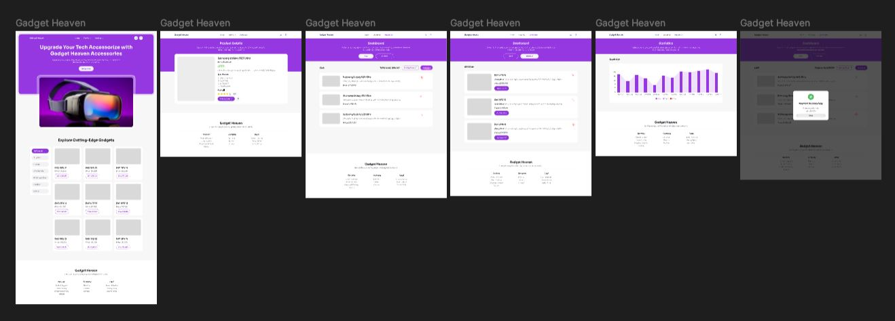

# Gadget Heaven

- Live URL https://gadget-heaven-b10-a8.surge.sh/

# List of React Fundamental concepts used in the project

- Conditional Rendering
- Component
- props
- Context API
- State
- react Router

# I'm using Context Api for handel and managing Data

# 5 key features

- Category wise product filter & Showing Product full details
- Cart section implement
- Also have Wish section, user can save item's for future purchas
- A statistics page , user can see all product price rating and name of the product
- A progress section , user can see order state

# Design

